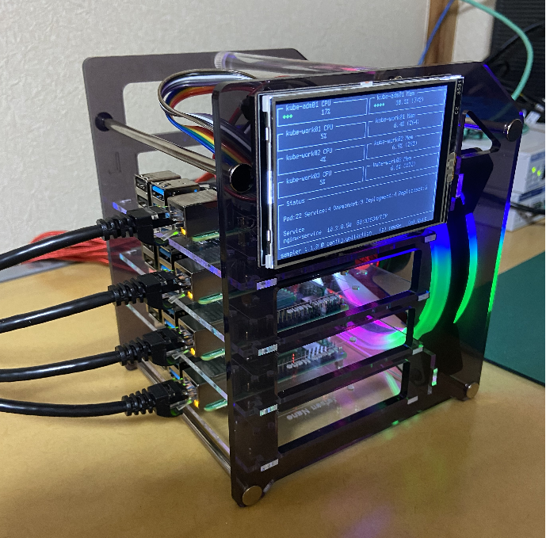

 
  
  

<h1 align="left">Hi 👋, I'm Tadashi Kanda</h1> 

  

<h2>🔭 I’m currently working on Network Engineer</h2> 

<h2> 👨‍💻 I’m currently learning </h2>

- angularJS
- kubernetes/Docker  
- Machine learning  

<h2> 💬 Ask me about </h2>

- BIGIP  
- NEC IX/QX  
- Cisco  
- Paloalto  
- Linux  
- Windows  

<h3 align="left">Skill:</h3>

               

